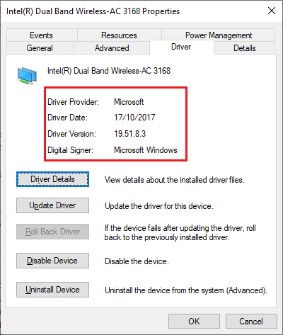
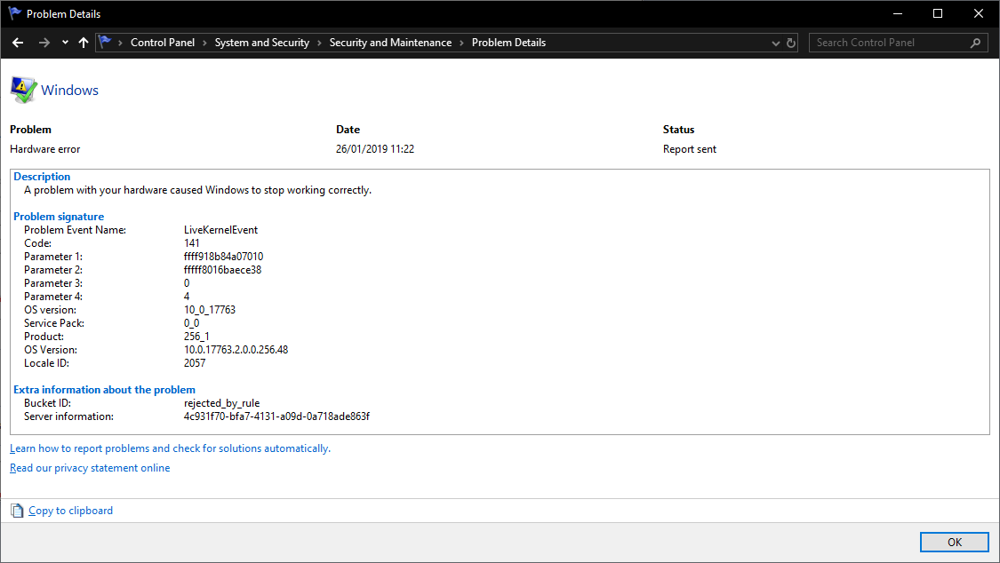
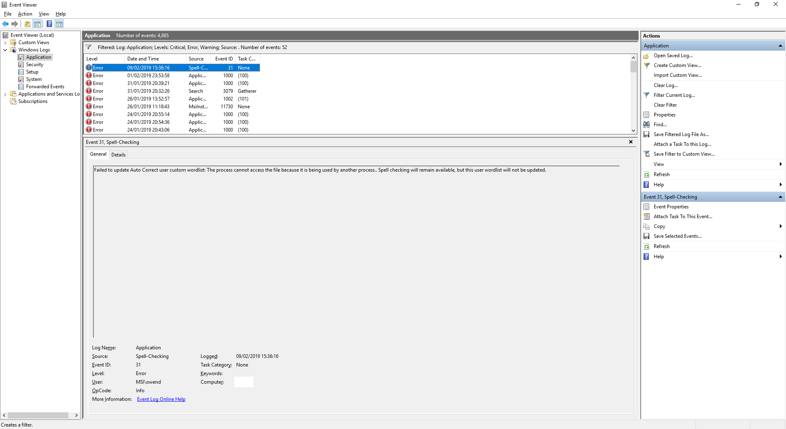

# Troubleshooting your computer

## SFC

This utility scans the system for corruption in the system files which may be responsible for irregular operating system behaviour.
For more information, check [this page](https://support.microsoft.com/en-us/help/929833/use-the-system-file-checker-tool-to-repair-missing-or-corrupted-system)

Use `DISM /Online /Cleanup-Image /RestoreHealth` if SFC fails to properly fix the problem

## IPCONFIG

This utility returns the IP configuration of your machine. If the IPv4 address begins with 169.254 it is considered as an APIPA address, and the network card is unable to retrieve an IP address from the DHCP server. Use `ipconfig /release` and `ipconfig /renew` in a command prompt to attempt retrieval of an IP address, otherwise check the DNS settings and drivers in Device Manager.

## Device Manager
When troubleshooting problems with your audio, video outputs or a device you connect into your system you should make sure to check that the drivers for them are properly installed on your system. If your system has recently updated them and they no longer function as desired, you can always roll back the drivers by right clicking the device in Device Manager, going to its Properties > Drivers tab then Roll Back Driver. If this still does not work well, you may wish to uninstall them then reboot the system.If you do not see drivers for your device in this utility (e.g. Unknown Device and your system does not register your device), you may wish to install them from the manufacturer's website or the CD provided along with the product.

Make sure you keep the device unplugged from the system while you install the appropriate drivers
In a driver's properties you may find it useful to know the driver revision date, and can check for drivers older than that date. 
1. 

In some cases you may not be able to find the appropriate drivers from the manufacturer's website, but on a third party website instead. Sometimes it doesn't have the correct name. It is strongly not recommended to do this, so proceed at your own risk:

1. Go on the Details tab and change the Property drop down menu contents to Hardware IDs.
2. Right click on the topmost result, copy it and paste it into your desired search engine.
3. If you find anything related to your device, proceed to the website with caution and get the drivers from there.

## System Restore
This utility can be game-saving when it comes to reverting your system back to a better known configuration where the operating system was last stable and applications had run fine. It is usually made whenever you install new drivers and updates, but is turned off by default in Windows 10. If you want to enable it, simply open the start menu and type in "System Restore". From there it should open up a window like this: 
1. 
2. Click "Configure" then Turn on system protection 
After you click OK, you may choose to create restore points by yourself or let Windows create the restore points for you.

If you want to revert to a known restore point, click "System Restore" and the wizard will load up. Be very careful which restore point you pick, as any programs you've installed after the restore point will be removed, and any programs you've uninstalled will be restored.

## Reliability history & Event Viewer
In some cases where you're experiencing operating system instability or application errors, you can always check Reliability history and Event Viewer to get a better idea of the problem. Uploading a screenshot of a related log in #tech-support may also give the people who are assisting you a better idea of how to approach the problem.

To find the reliability history, search "View reliability history" in the start menu and click the first result. It will bring up a window similar to this: 

Note that inside the red square there are 3 different categories: informational events, warnings and critical events. They would also show the source (or application) that resulted the event in the history, and clicking "View technical details would take you to a window like this example, giving you further information on the event and why it happened. It may also help you find solutions if you copied the Problem Event Name.

You can also navigate events that happened in the past which may have led to your current problem.
Event viewer is slightly more complex, but has further information on the operating system if it is more than one application that is misbehaving. To find this utility, right click the start menu, click "Event Viewer". Once it opens, notice there are different categories of event logs on the top left corner. Usually you would want to check Application logs, just expand "Windows Logs" then click on "Applications". It would bring up a similar window to this: https://i.imgur.com/gtZcB0s.png

To look for specific types of logs like critical or, warning or errors, simply click "Filter Current Log" from the top-right corner, and tick the "Critical", "Warning", and "Error" checkboxes. https://i.imgur.com/jGJmQM4.png

After applying the filter, you may get a window like this. Press down and inspect the logs that were created at the exact time you begun to experience the problems.

In the general pane, you may copy the first few sentences and paste it in #tech-support or search for a solution on a search engine.
